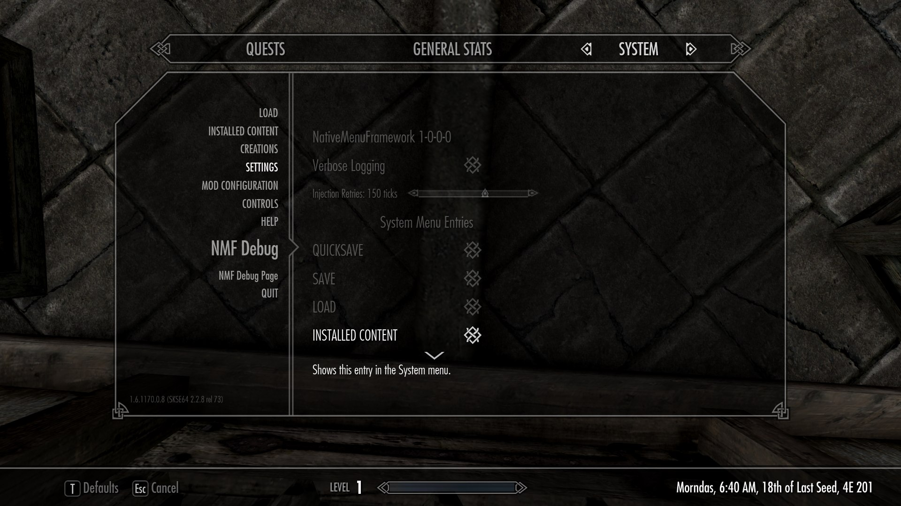
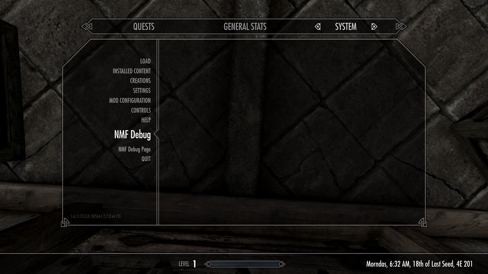
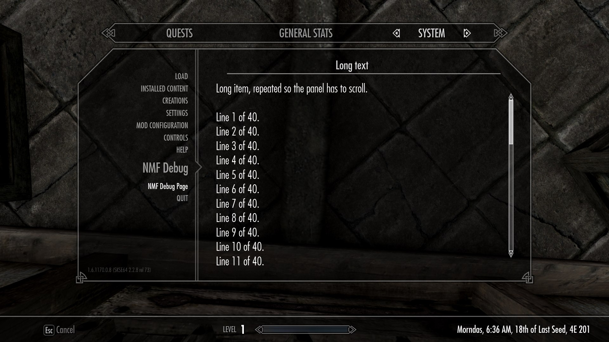

# NativeSystemMenuFramework

Adds entries and real vanilla widgets to Skyrim's own System (Escape) menu -
no overlay, no replaced swf, no new menu. Everything goes into the menu the
game already has, live, at runtime.

It is an optional dependency: every call is safe to make unconditionally, and
a mod built against it still works when it isn't installed.

A mod gets three shapes, all of them the game's own screens.

**Settings > your tab.** Real ScrollBar / OptionStepper / CheckBox widgets,
alongside Gameplay, Display and Audio, with a description under the selected
row:



**An entry in the System menu**, between the game's own. It can open your tabs,
jump straight into one, or just call you back:



**A page** - a list of items, each opening a panel of scrolling text. For a
readme or a changelog, not for settings:



The `NSMF` entries in these shots are the framework's own development items,
which only appear with `[Debug] Verbose` on.

## Installing

**As a player**, install it like any SKSE plugin - with a mod manager, or by
copying `SKSE/` and `Interface/` into your Data folder. Mods that use it pick
it up on their own.

It improves the game's own Settings screen even with no mod using it:

- **Descriptions on Skyrim's own rows.** Every Gameplay, Display and Audio
  setting gets a line explaining what it actually does - Save on Pause sets the
  autosave timer, the four Fade rows are draw distances.
- **Click a row's label** to tick its checkbox, instead of aiming at the small
  box on the right. Skyrim's own rows included.
- **Dropdown arrows disappear at their limits** instead of sitting there doing
  nothing, on vanilla's rows as well as ours.
- **A scrollbar on the Settings lists**, in place of the two arrows, so a long
  tab shows how far it runs.
- **Hiding System menu entries**, from a `Native System Menu Framework` tab under
  Settings. Skyrim's own included, so Save, Load or Installed Content can be
  taken off the list. Settings and Quit are always kept.

**As a mod author**, it is a soft dependency: nothing to bundle and nothing to
link. Copy `include/NativeSystemMenuFramework.h` into your project, call whatever you
need, and tell your users to install the framework to get the menu. Without it
your mod loads and runs exactly as before, minus the menu. The header is 0BSD,
so it fits any mod.

## Quick start

Drop `include/NativeSystemMenuFramework.h` into your project. No linking, it's
resolved via `GetProcAddress` at runtime.

```cpp
#include "NativeSystemMenuFramework.h"

void Register()
{
    NativeSystemMenuFramework::SetModName("MyMod");  // your DLL's name

    NativeSystemMenuFramework::AddSystemMenuEntry("My Mod", &OnEntrySelected);

    NativeSystemMenuFramework::AddVanillaSetting("Display", NativeSystemMenuFramework::SettingType::kCheckbox,
        "My Setting", &GetMySetting, &SetMySetting, 0.0f);
}
```

Call `Register` from your SKSE listener at `kPostPostLoad`, not from
`SKSEPluginLoad`.

[docs/API.md](docs/API.md) has the rest - why that timing, widget types, tabs,
units, descriptions, and the reset-to-defaults hook.

## What it does for you

Rows are real vanilla widgets, not lookalikes, driven through the same
dispatch Skyrim uses for its own. The rest is what the Settings screen lacks
once it grows past what Bethesda designed it for:

- **Scrolling** - the Settings lists ship with a pair of arrows and no bar.
  The framework attaches the interface's own `JournalScrollBar`, the one the
  Help and Creations lists use, hands the sizing back to the game and hides
  the arrows. An interface without that bar keeps them.
- **Descriptions** - an optional line under the rows, shown while a row is
  selected. Tabs can carry one too. Skyrim's own rows and tabs get them.
- **Disabled rows** - a row that your code currently ignores can say so, and
  is greyed and made non-interactive rather than silently doing nothing.
- **Click the label** - pressing anywhere on a checkbox or button row toggles
  it, instead of having to hit the small widget on its right.
- **Reset to defaults** - custom rows are reset by vanilla's own key, with no
  extra code.
- **Predictable ordering** - your tabs stay together, in the order you declare
  them, and the groups are ordered by mod name rather than by plugin load
  order.
- **Pages** - a third shape besides settings and tabs: a list of items, each
  opening a panel of text, for anything a player reads rather than sets.
- **Hiding** - the player can hide System menu entries, vanilla ones included,
  from the framework's own tab. Stored by name, so a replaced interface or a
  version without the Creations entry changes nothing.
- **Translations** - drop `Interface/Translations/<mod>_<language>.txt` next to
  your DLL and use `$KEY` as your text. Skyrim's own format, read by the
  framework rather than the engine, so **no esp is needed**. The framework's
  own strings ship complete in nine languages.

## Known limits

- **Tested on Skyrim 1.6 only.** Version-specific values are read from the
  running game rather than hardcoded, and the plugin builds for SE, AE and VR,
  but only 1.6 has actually been run.
- A mod that registers while the System menu is already open appears the next
  time it is opened.
- **Interface replacers.** Sizes and positions are measured off the live
  interface, so a replacer's layout is followed within what it provides. One
  without vanilla's `JournalScrollBar` keeps its arrows. One that fits more
  rows into the same panel leaves no band under them for a description, which
  is what `DescriptionRows` is for: a panel clip reports the size of its
  contents rather than its frame, so nothing can measure that band and the
  player picks.

## Building from source

Only needed to work on the framework itself - a mod that consumes it needs
nothing from this section.

- Visual Studio 2022
- CMake 3.21+
- vcpkg, with the `VCPKG_ROOT` environment variable set

CommonLibSSE-NG is not stored in this repository. Clone it into `extern/`
before configuring:

    git clone --recurse-submodules https://github.com/alandtse/CommonLibSSE-NG.git extern/CommonLibSSE-NG

From an **x64 Native Tools Command Prompt for VS 2022**:

    cmake --preset release
    cmake --build build/release

The first configure builds CommonLibSSE-NG and takes a few minutes.

### Deployment

Set one of these environment variables and the plugin is copied after every
build:

- `SKYRIM_MODS_FOLDER` - the `mods` folder of Mod Organizer 2 or Vortex
- `SKYRIM_FOLDER` - a Skyrim Special Edition install

## Settings

`NativeSystemMenuFramework.ini`, next to the DLL:

- `[General] InjectionRetryTicks` - how many menu update ticks to keep
  retrying the injection before giving up. It is attempted every tick and
  stops on success, so this is an upper bound rather than a wait. Raise it
  if entries don't show up alongside other menu-modifying mods. Held between
  30 and 230.
- `[General] DescriptionRows` - rows the Settings lists give up so a
  description has room under them. `0` by default, which is right for
  vanilla: it already leaves a band free. Raise it to `1` or `2` if an
  interface replacer fits enough rows that descriptions run past the panel.
  Also a dropdown in the framework's own tab, applied as you change it.
- `[Debug] Verbose` - off by default. Logs menu clicks, callback dispatch,
  injection details and dumps of the menu's live object tree. It also adds
  development-only menu items - an `NSMF Debug` entry and four `NSMF Filler`
  tabs - which exercise those code paths and push the tab list past the screen
  so the scrollbar has something to show. Turn it on to diagnose an
  integration issue, from the framework's own tab or the ini.

## License

GPL-3.0, with the same modding exceptions as CommonLibSSE-NG. The one file
meant to be copied elsewhere, `include/NativeSystemMenuFramework.h`, is 0BSD and
asks nothing of the mod that copies it.

## Credits

- [SKSE](https://skse.silverlock.org/)
- [CommonLibSSE-NG](https://github.com/alandtse/CommonLibSSE-NG) by
  [alandtse](https://github.com/alandtse), forked from
  [CommonLibSSE](https://github.com/Ryan-rsm-McKenzie/CommonLibSSE) by
  [Ryan-rsm-McKenzie](https://github.com/Ryan-rsm-McKenzie)
- [spdlog](https://github.com/gabime/spdlog) by
  [gabime](https://github.com/gabime)
- [simpleini](https://github.com/brofield/simpleini) by
  [brofield](https://github.com/brofield)
- [JPEXS Free Flash Decompiler](https://github.com/jindrapetrik/jpexs-decompiler)
  by [jindrapetrik](https://github.com/jindrapetrik), used to read the
  interface's ActionScript

The widgets and the layout are Bethesda's.

## Layout

    src/PCH.h              precompiled header, force-included everywhere
    src/plugin.cpp         entry point and SKSE message listener
    src/Logging.*          log file setup
    src/Config.*           INI reading
    src/NativeMenu.*       System menu entries (CategoryList injection)
    src/VanillaSettings.*  real widgets in Gameplay/Display/Audio and
                           custom tabs
    src/VanillaDescriptions.h  descriptions for Skyrim's own rows
    src/Text.h             UTF-8 to UTF-16 for Scaleform, with interning
    src/Debug.*            development-only: tree dumps and placeholder menu
                           items, all behind [Debug] Verbose
    src/Pages.*            list-plus-text pages, on vanilla's Help panel
    src/Translations.*     Skyrim's translation files, loaded by us not the engine
    src/SystemState.h      SystemPage's state constants, read from the game
    src/Ordering.h         how mods are ordered against each other
    src/ListRows.*         duplicating a list's row clips past what it ships
    src/Exports.cpp        the C API other plugins resolve via GetProcAddress
    include/               public header for consumers (NativeSystemMenuFramework.h)
    SKSE/Plugins/          the default ini, deployed only when missing
    Interface/Translations/  the framework's own strings, nine languages
    docs/API.md            full API reference
