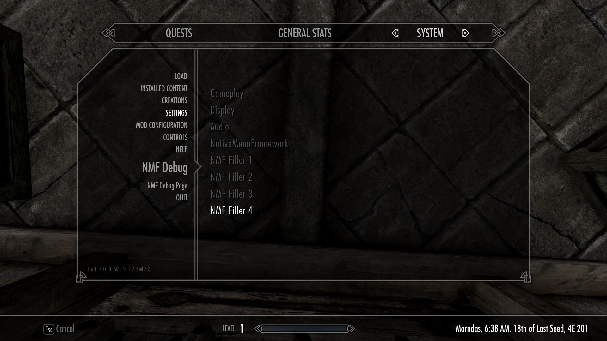
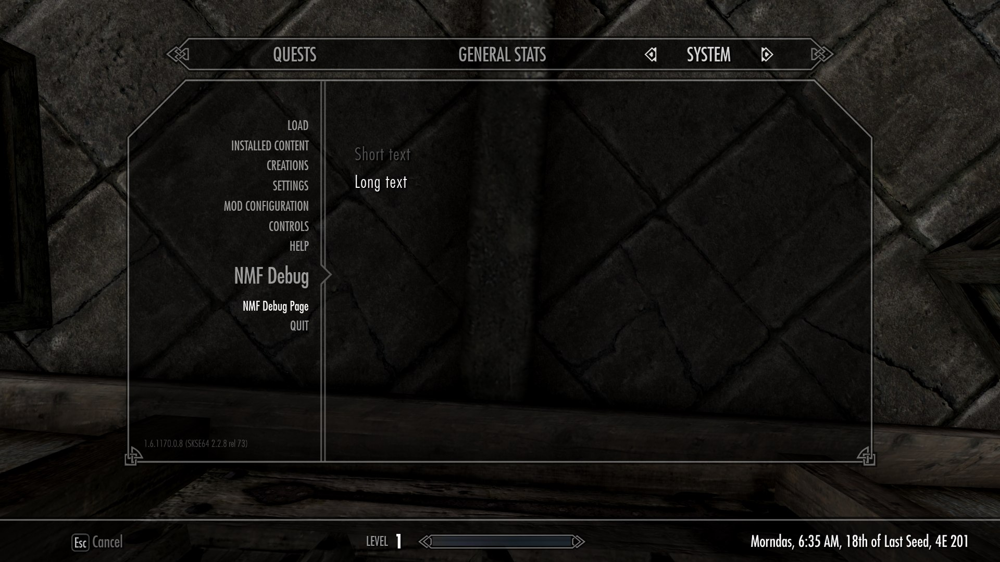

# API reference

Everything lives in `include/NativeSystemMenuFramework.h`. Resolved via
`GetProcAddress` - no linking, drop the header in and call the functions
directly. The header is 0BSD, so it fits a mod under any license. Every call
is safe to make unconditionally: if NativeSystemMenuFramework isn't installed, they
just no-op / return `false`.

Start with [`SetModName`](#setmodname), then register whatever you need.

## When to call

From your SKSE message listener at `kPostPostLoad`, never from
`SKSEPluginLoad`.

SKSE loads each plugin and calls it before moving to the next, so a plugin
whose file name sorts before `NativeSystemMenuFramework.dll` runs while the
framework is not in the process yet. Every call returns `false` and the rows
are lost, silently. `kPostPostLoad` is dispatched once every plugin is loaded,
whatever the order.

```cpp
SKSEPluginLoad(const SKSE::LoadInterface* a_skse)
{
    SKSE::Init(a_skse);
    SKSE::GetMessagingInterface()->RegisterListener([](SKSE::MessagingInterface::Message* a_message) {
        if (a_message->type == SKSE::MessagingInterface::kPostPostLoad)
            Register();  // your SetModName and Add* calls
    });
    return true;
}
```

## What do I want?

| I want to...                                       | Use                                              |
|----------------------------------------------------|--------------------------------------------------|
| Add a setting the player can change                | [`AddVanillaSetting`](#addvanillasetting)        |
| Show a value without letting them change it        | [`AddVanillaLabel`](#addvanillalabel)            |
| Run an action when they click a row                | [`AddVanillaButton`](#addvanillabutton)          |
| Group my settings in a tab of my own               | any of the above, with a `tab` name of your own  |
| Explain what one of my tabs is for                 | [`SetVanillaTabDescription`](#setvanillatabdescription) |
| Put my mod in the Escape menu, next to Save / Quit | [`AddSystemMenuEntry`](#addsystemmenuentry)      |
| Show text a player reads - a readme, a changelog   | [`AddSystemMenuPageItem`](#addsystemmenupageitem)|
| Ship my text in more than one language             | [Translations](#translations)                    |
| Expose a real ini setting the vanilla menu doesn't | [`GetIniSetting`/`SetIniSetting`/`SaveIniSetting`](#getinisetting--setinisetting--saveinisetting) |

## `IsInstalled()`

```cpp
bool NativeSystemMenuFramework::IsInstalled();
```

True when the framework is loaded and its API can be called. Not required
before the other functions - they check for you - but useful to skip setup
work you would otherwise do for nothing.

## `SetModName`

```cpp
void SetModName(const char* name);
```

Names the mod behind everything you register afterwards. Call it once, before
your first `Add*` call.

```cpp
NativeSystemMenuFramework::SetModName("MyMod");
```

**Use your DLL's name.** This is an identifier, never shown to the player, and
it is also the name of your translation files - `MyMod_english.txt` for the
example above. A name that doesn't match them means none of them load and every
key renders as a key. The log says so when it happens.

The framework keeps one mod's tabs together and orders the groups by mod name,
so the menu doesn't depend on which plugin SKSE happened to load first -
renaming a DLL never reshuffles it. Comparison ignores case.

The name is stored in your own plugin: this header is compiled into it, so two
mods can never overwrite each other's, whatever order they register in.

Skipping it costs you nothing but grouping - your tabs are still added, each
one simply forms its own group under its own name.

## Ordering



**Your tabs appear in the order you declare them.** That is a guarantee, not an
accident: the framework sorts groups against each other but never reorders
within one, because that order carries a decision only you can make.

**Where your group lands is not yours to choose.** There is no priority
parameter on purpose: between mods that don't know each other, everyone picks
the same number and nothing is settled. The rule is the mod name.

**Vanilla's three tabs never move.** `onSettingsCategoryPress` is a hardcoded
`switch` on indices 0, 1 and 2 in the interface's own ActionScript, so
Gameplay / Display / Audio stay first and custom tabs follow.

**Rows inside a tab follow your declaration order too**, and two mods may add to
the same tab. A tab belongs to whoever created it - only one of them can decide
where it sits.

## Translations

A mod ships its text next to its DLL and needs no esp:

```
Data/Interface/Translations/<mod name>_<language>.txt
```

The mod name is the one passed to [`SetModName`](#setmodname). UTF-16LE with a
BOM, one `$KEY<tab>Value` per line - Skyrim's own format, so xTranslator works
on it and a translator needs no new habits. UTF-8 is accepted too, for files
edited by hand. Folder and file names are matched case-insensitively, because
both spellings ship in the wild.

Then use the keys as your text:

```cpp
AddVanillaSetting("Display", Type::kCheckbox, "$MYMOD_MOTION_BLUR", &Get, &Set, 0.0f, {},
    nullptr, nullptr, "$MYMOD_MOTION_BLUR_DESC");
```

`<mod>_english.txt` loads first as a fallback, then the game's language over
it, key by key - a half-translated file still shows English for the rest.

**A key nothing knows passes through untouched**, never replaced. The engine
resolves the game's own keys (`$QUICKSAVE` and friends) and the framework
relies on that, so anything else it cannot resolve is left for the engine to
try.

**Why the framework loads these files itself**: the engine only reads them for
plugins in the load order, so a DLL-only mod would otherwise need a dummy esp
just to be translatable.

**Three things to know when writing text:**

- Strings are UTF-8 in. Passing raw Windows-1251 or Shift-JIS bytes will
  mangle them.
- Non-Latin scripts render only if the player's font set covers them - the
  game loads one per language. That is the same limit vanilla text has.
- Buffer sizes in this reference are bytes, which is what `snprintf` counts,
  not letters. Latin text runs one byte a character, accented and Cyrillic
  two, CJK three. Only the callbacks that fill a buffer have a size at all -
  a label, a description or a tab name you hand over is copied whole.

### `Translate`

```cpp
std::string Translate(const char* key);
```

The translation for a key, or the key itself when nothing knows it. Only needed
for text your own code assembles, which the framework never sees as a whole key
- a status line, a unit glued to a value. Anything handed to the framework
whole is resolved for you. A translation longer than 512 bytes is cut.

```cpp
void __stdcall GetStatus(char* buffer, int size)
{
    std::snprintf(buffer, size, "%s: %s",
        NativeSystemMenuFramework::Translate("$MYMOD_STATUS").c_str(),
        NativeSystemMenuFramework::Translate(active ? "$MYMOD_ON" : "$MYMOD_OFF").c_str());
}
```

## `AddSystemMenuEntry`

```cpp
bool AddSystemMenuEntry(const char* text, EntryCallback callback = nullptr,
    const char* jumpToTab = nullptr);
```

Adds one entry to the System (Escape) menu's top-level list, alongside Save /
Load / Settings / Controls / Help / Quit. `callback` runs when the entry is
selected, on the menu's own update tick - not the render thread, not
mid-frame. Keep it cheap: flip a flag, open your own window, register your
settings.

```cpp
void __stdcall OnEntrySelected() { MyWindow::Open(); }
NativeSystemMenuFramework::AddSystemMenuEntry("My Mod", &OnEntrySelected);
```

**`jumpToTab`** - optional. Drives the page straight into that tab's
settings on click, skipping "open Settings, then pick a category" - the
entry acts like its own settings page instead of just running a callback.
Works for a native tab name or any custom tab name already used in
`AddVanillaSetting`/`AddVanillaLabel`. `callback` can be `nullptr` if you
only want the jump.

```cpp
NativeSystemMenuFramework::AddSystemMenuEntry("My Mod", nullptr, "Display");
```

Note what this is: a shortcut into the Settings screen, not a screen of its
own. The player lands on a real settings tab, so leaving it follows the
Settings screen's own way out - through the category list, with vanilla's
save step.

**With neither a callback nor a tab**, the entry opens your own tabs as a list
of their own, which is what a mod with more than one tab usually wants. That
needs [`SetModName`](#setmodname) - it is what tells the framework which tabs
are yours.

```cpp
NativeSystemMenuFramework::SetModName("MyMod");
NativeSystemMenuFramework::AddVanillaSetting("Display", ...);      // a native tab
NativeSystemMenuFramework::AddVanillaSetting("MyMod Effects", ...);  // two of your own
NativeSystemMenuFramework::AddVanillaSetting("MyMod Advanced", ...);
NativeSystemMenuFramework::AddSystemMenuEntry("My Mod");           // opens those two
```

## `AddVanillaSetting`

```cpp
bool AddVanillaSetting(const char* tab, SettingType type, const char* label,
    SettingGetter getValue, SettingSetter onChange, float defaultValue,
    const std::vector<std::string>& options = {}, SettingIsEnabled isEnabled = nullptr,
    SettingFormatValue formatValue = nullptr, const char* description = nullptr,
    SettingCommit onCommit = nullptr);
```

Adds a real ScrollBar/OptionStepper/CheckBox row - the same widgets Bethesda
uses in its own Gameplay/Display/Audio tabs, driven through the same
`GameDelegate.call("OptionChange", ...)` dispatch those rows use. Not a
lookalike built from scratch.

**`tab`** - `"Gameplay"`, `"Display"` or `"Audio"` adds to that native tab.
Any other string creates a new tab the first time it's used, and every
subsequent call with the same name adds to it.

**`type`** (`NativeSystemMenuFramework::SettingType`):

| Type         | Widget                    | Value range                  |
|--------------|----------------------------|-------------------------------|
| `kSlider`    | ScrollBar                  | `0.0` - `1.0`                 |
| `kDropdown`  | OptionStepper (prev/next)  | index into `options`          |
| `kCheckbox`  | CheckBox                   | `0.0` or `1.0`                |

`kLabel` and `kButton` belong to [`AddVanillaLabel`](#addvanillalabel) and
[`AddVanillaButton`](#addvanillabutton). Passing either here returns `false`
and logs why, rather than adding a row with nothing bound to it.

**`getValue`/`onChange`** - plain `__stdcall` function pointers, not member
functions or lambdas with captures. Called on the menu's own update tick.
`onChange` should update your own settings storage - NativeSystemMenuFramework
doesn't own your data.

`getValue` is polled every tick for as long as the row is on screen, so the
row follows your own state even when something else changes it. Return a
value you already hold; don't compute or allocate one there.

A ScrollBar reports every step a drag passes through, not the value it is
released on, so `onChange` runs dozens of times a second while a slider
moves. Keep it to applying the value, and put anything expensive - writing an
ini, reloading a shader, reallocating a buffer - in `onCommit`.

**`defaultValue`** - same units as `getValue`/`onChange`. Hooks your row into
vanilla's own "reset settings to default" (Y button / T key while a settings
tab is open) - every row with a `defaultValue` gets reset the same way real
vanilla rows do, no extra code needed on your end.

**`options`** - only used by `kDropdown`, the list of labels shown as the
player steps through them.

**`isEnabled`** - optional. Asked every tick while the row is on screen, like
`getValue`, so keep it to a comparison. Returning `false` greys the row out
and, for `kDropdown`, hides whichever arrow is already at its current limit.
`onChange` simply won't be called while disabled - you don't need to guard
against that yourself.

```cpp
bool __stdcall IsScaleEnabled() { return Settings::mode != Settings::kFixedMode; }
AddVanillaSetting("Display", Type::kSlider, "Scale", &GetScale, &SetScale, 1.0f, {}, &IsScaleEnabled);
```

**`formatValue`** - optional, `kSlider` only. A ScrollBar is just a bar with
no readout, so if the real unit matters (fps, degrees, whatever isn't just a
plain percentage), this appends it to the label live as the row is dragged.
The buffer holds 64 bytes.

```cpp
void __stdcall FormatFps(float value, char* buf, int size) { snprintf(buf, size, "%d fps", (int)(value * 210 + 30)); }
AddVanillaSetting("Display", Type::kSlider, "FPS Limit", &GetFpsLimit, &SetFpsLimit, 0.5f, {}, nullptr, &FormatFps);
```

A ScrollBar has 21 stops, so pick a range that lands on them or the readout
drifts off the stored value. 30 to 230 steps by 10 and reads back exactly;
30 to 300 steps by 13.5 and shows 150 as 152.

**`onCommit`** - optional. Runs once the value has settled: the drag held
still, the selection moved to another row, or the menu closed. A checkbox or
dropdown has nothing to drag, so it commits as soon as it changes.

It is always preceded by the `onChange` carrying the same value, and runs at
most once per value the row lands on. A drag that pauses long enough part-way
commits there too - it has settled, as far as anything can tell - so treat it
as "this value is worth keeping", not "the player let go".

```cpp
void __stdcall SetStrength(float v) { Settings::strength = v; ApplyLive(); }   // every step
void __stdcall CommitStrength(float)  { Settings::Save(); }                    // once it settles

AddVanillaSetting("Display", Type::kSlider, "Strength", &GetStrength, &SetStrength, 1.0f, {},
    nullptr, nullptr, "How strong the effect is.", &CommitStrength);
```

**`description`** - optional. Shown under the rows while this row is
selected, in the space vanilla leaves empty. One sentence in plain language,
saying what the setting does rather than restating its name.

```cpp
AddVanillaSetting("Display", Type::kCheckbox, "Motion Blur", &Get, &Set, 0.0f, {}, nullptr, nullptr,
    "Blurs the screen during fast movement.");
```

### Example

```cpp
// One commit for every row - the setters have already applied the value.
void __stdcall OnCommit(float) { Settings::Save(); }

float __stdcall GetMotionBlur() { return Settings::motionBlur ? 1.0f : 0.0f; }
void __stdcall SetMotionBlur(float v) { Settings::motionBlur = v != 0.0f; }

float __stdcall GetQuality() { return static_cast<float>(Settings::quality); }
void __stdcall SetQuality(float v) { Settings::quality = static_cast<int>(v); }

float __stdcall GetStrength() { return Settings::strength; }
void __stdcall SetStrength(float v) { Settings::strength = v; }

using NativeSystemMenuFramework::AddVanillaSetting;
using Type = NativeSystemMenuFramework::SettingType;

AddVanillaSetting("Display", Type::kCheckbox, "Motion Blur", &GetMotionBlur, &SetMotionBlur, 0.0f,
    {}, nullptr, nullptr, nullptr, &OnCommit);
AddVanillaSetting("Display", Type::kDropdown, "Quality", &GetQuality, &SetQuality, 0.0f,
    { "Low", "Medium", "High" }, nullptr, nullptr, nullptr, &OnCommit);
AddVanillaSetting("Accessibility", Type::kSlider, "Strength", &GetStrength, &SetStrength, 1.0f,
    {}, nullptr, nullptr, nullptr, &OnCommit);
```

`"Accessibility"` above isn't a native tab - the first `AddVanillaSetting`
call using that name creates it, right alongside Gameplay/Display/Audio.

Labels, dropdown options and descriptions all accept a `$KEY` and are resolved
for you - see [Translations](#translations). Literal text works too, and is
passed straight through: strings are UTF-8 in and converted before they reach
Scaleform, so non-Latin scripts render correctly.

## `AddSystemMenuPageItem`

```cpp
bool AddSystemMenuPageItem(const char* page, const char* label, PageGetText getText);
```



Adds one item to a page of your own: a list of items, each opening a panel of
text. Nothing to do with settings - it is the shape of the game's own Help
screen, so the list and the text both scroll on their own.

The page is created the first time a name is used and gets its own entry in the
System menu, alongside Save / Load / Settings. Every later call with the same
name adds to it, in call order.

```cpp
void __stdcall GetChangelog(char* buf, int size) { snprintf(buf, size, "1.2 - ...
1.1 - ..."); }
AddSystemMenuPageItem("Rose Graphics Suite", "Changelog", &GetChangelog);
```

`getText` is called each time the item is opened, so a page can report
something that changes rather than only fixed prose. Up to 4096 bytes.

Good for a readme, a changelog, an about page, a stats screen - anything a
player reads rather than sets.

## `AddVanillaLabel`

```cpp
bool AddVanillaLabel(const char* tab, LabelGetText getText, TextAlign align = TextAlign::kLeft);
```

A read-only row - no widget binds, so it is just text. Same tab rules as
`AddVanillaSetting`. `getText` is called every tick, so a row can report
something that changes, not only static text. The buffer holds 128 bytes.

```cpp
void __stdcall GetGpu(char* buf, int size) { snprintf(buf, size, "GPU: %s", Renderer::GpuName()); }
AddVanillaLabel("MyMod Debug", &GetGpu);
```

Keep the text stable, though: every distinct string is kept for Scaleform's
sake, so a row that reads differently on every tick - a live frame counter -
grows that store for as long as the menu is open.

**`align`** - `kLeft`, `kCenter` or `kRight`. Label rows only: a setting row
carries a widget on the right, so its text has nowhere to move. Centring is
what makes a label read as a section heading.

```cpp
AddVanillaLabel("Debug", &GetSectionTitle, NativeSystemMenuFramework::TextAlign::kCenter);
```

## `AddVanillaButton`

```cpp
bool AddVanillaButton(const char* tab, const char* label, ButtonPress onPress);
```

Vanilla has no button widget - this uses the real CheckBox, snapped back to
unchecked every frame instead of staying toggled, so a click reads as a
momentary press rather than a persistent setting. `onPress` runs once per
click, on the menu's own update tick. Same tab rules as `AddVanillaSetting`.

```cpp
void __stdcall OnReload() { Shaders::ReloadFromDisk(); }
AddVanillaButton("Debug", "Reload Shaders", &OnReload);
```

## `SetVanillaTabDescription`

```cpp
bool SetVanillaTabDescription(const char* tab, const char* description);
```

Shows a line under the category list while `tab` is highlighted there, the way
a row's own description works. It appears both in the full tab list under
Settings and in the narrowed list a System menu entry opens.

Call it once, next to your `Add*` calls. An empty description clears it.

```cpp
SetVanillaTabDescription("My Mod", "$MYMOD_TAB_DESC");
```

Skyrim's own Gameplay, Display and Audio tabs get one from the framework.

## `GetIniSetting` / `SetIniSetting` / `SaveIniSetting`

```cpp
float GetIniSetting(const char* name);
void  SetIniSetting(const char* name, float value);
bool  SaveIniSetting(const char* name);
```

Binds a real engine ini setting - one already sitting in Skyrim.ini or
SkyrimPrefs.ini, but with no row in the vanilla menu - to a `getValue`/
`onChange` pair for [`AddVanillaSetting`](#addvanillasetting), the same way
its own rows work. `name` is the setting's own name, e.g.
`"fDefaultWorldFOV:Display"`.

`GetIniSetting`/`SetIniSetting` only touch the live value - cheap enough for
a `SettingGetter`/`SettingSetter`, which run every tick and every drag step.
`SaveIniSetting` writes it to disk and belongs in `onCommit` instead, exactly
like any other expensive work there.

```cpp
constexpr float kMinFov = 60.0f, kMaxFov = 120.0f;

float __stdcall GetFov() { return (GetIniSetting("fDefaultWorldFOV:Display") - kMinFov) / (kMaxFov - kMinFov); }
void  __stdcall SetFov(float v) { SetIniSetting("fDefaultWorldFOV:Display", kMinFov + v * (kMaxFov - kMinFov)); }
void  __stdcall CommitFov(float) { SaveIniSetting("fDefaultWorldFOV:Display"); }

AddVanillaSetting("Display", Type::kSlider, "Field of View", &GetFov, &SetFov, 0.5f, {},
    nullptr, nullptr, nullptr, &CommitFov);
```

A setting name that doesn't exist logs a line saying so and `GetIniSetting`/
`SaveIniSetting` fall back to `0.0f`/`false` - a wrong name is a mod bug, not
something to hide.
